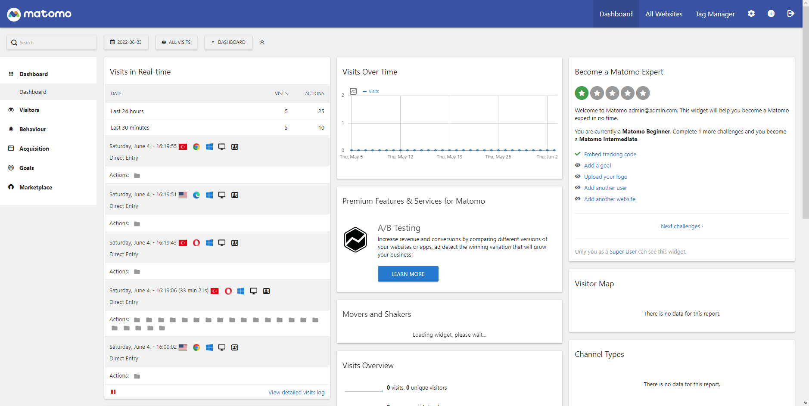

# matomo-1



This project is demonstrating how to use the matomo-php to track visits and conversions. This app is formerly known as the **piwik** and is a free open source google analytics alternative project.

## Installation

 - Open http://localhost:{MATOMO_PORT} and finish the installation wizard.
 - First step may take a while, so wait until the response.
 - In 6th step, set up domain as `http://localhost:{LARAVEL_APP_PORT}`
 - It 7th step, you will recieve tracking code. Copy to `laravel-app`

After installation you should add trusted host to [config.ini.php](./matomo-app/config/config.ini.php)

```php
...

[General]
salt = "f9046f1ae0b5a012802a568359828b78"
trusted_hosts[] = "localhost:{MATOMO_PORT}"

...
```

Then you can login with your admin credentials at `http://localhost:{MATOMO_PORT}/index.php`

- Take script code and add it to `laravel-app/resources/views/head.blade.php` and navigate to `http://localhost:{LARAVEL_APP_PORT}`.
- Matomo will track your visits and conversions automatically.
- You must be **disable adblocker** to see tracking code.